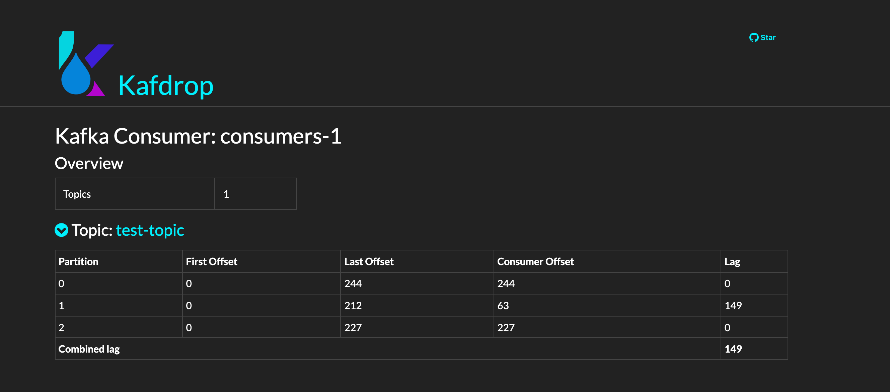

# :eyes: Monitoring kafka consumer lag with Burrow.

These examples explain how to monitor kafka consumer lag with [Burrow](https://github.com/linkedin/Burrow).

[docker-compose.yaml](./docker-compose.yaml) consists of below applications.  

| Container                | host:port                              | Description                                       |
|--------------------------|----------------------------------------|---------------------------------------------------|
| **zoo1**                 | zoo1:21810                             | single zookeeper for kafka and burrow local       |
| **kafka1,kafka2,kafka3** | kafka1:19092,kafka2:19093,kafka3:19094 | kafka clusters                                    |
| **kafdrop**              | kafdrop:9000                           | kafka UI                                          |
| **burrow-demo**          | burrow-demo:8900                       | testing for consumers. start producer, consumers. |
| **burrow**               | burrow:8000                            | monitoring kafka consumer lag(cluster1)           |
| **burrow-dashboard**     | burrow-dashboard:3000                  | burrow dashboard UI                               |
| **burrow-ui**            | burrow-ui:3100                         | burrow tools UI                                   |

---  

### 1. Build burrow docker image

Clone [Burrow](https://github.com/linkedin/Burrow) and build docker image.
(Although u can pull solsson/burrow from docker-hub, this image pushed 2 years ago.)

```shell
$ git clone git@github.com:linkedin/Burrow.git
$ cd Burrow
// build image with "burrow_burrow" repository name.
$ docker-compose build
$ docker images burrow_burrow
REPOSITORY      TAG       IMAGE ID       CREATED        SIZE
burrow_burrow   latest    d8de5fb0a54c   14 hours ago   26.8MB
```

### 2. Build burrow-all application i.e this repository.

```shell
$ docker-compose build
```  

### 3. Start docker-compose  

```shell
$ docker-compose up
```

### 4. Check brokers and Create a topic.  

Connect to kafdrop http://localhost:9000 at ur browser.  

  

Create a new topic `test-topic` with 3 partitions and 1 replica.  

  

### 5. Check burrow dashboard and curl  

Connect to http://localhost:3000 at ur browser.  

  

Check burrow.  

```shell
$ curl -XGET http://localhost:8000/v3/kafka
{"error":false,"message":"cluster list returned","clusters":["local"],"request":{"url":"/v3/kafka","host":"a2eabfab41ea"}}

$ curl -XGET http://localhost:8000/burrow/admin
GOOD

$ curl -XGET http://localhost:8000/v3/kafka/local
{"error":false,"message":"cluster module detail returned","module":{"class-name":"kafka","servers":["kafka1:19092","kafka1:19093","kafka1:19094"],"client-profile":{"name":"profile","client-id":"docker-client","kafka-version":"2.1.0","tls":null,"sasl":null},"topic-refresh":10,"offset-refresh":10},"request":{"url":"/v3/kafka/local","host":"a2eabfab41ea"}}

$ curl -XGET http://localhost:8000/v3/kafka/local/topic
{"error":false,"message":"topic list returned","topics":["__consumer_offsets","__confluent.support.metrics","test-topic"],"request":{"url":"/v3/kafka/local/topic","host":"a2eabfab41ea"}}

$ curl -XGET http://localhost:8000/v3/kafka/local/consumer
{"error":false,"message":"consumer list returned","consumers":[],"request":{"url":"/v3/kafka/local/consumer","host":"a2eabfab41ea"}}
```  

### 6. Start kafka producer & consumers  

```shell
// start producer p1 with 100ms(message producing interval)
$ curl -XPOST http://localhost:8900/v1/producer/p1/test-topic?interval=100ms
{"status":"created","metadata":{"interval":"100ms","name":"p1_test-topic","topic":"test-topic"}}

// start consumer c1
$ curl -XPOST http://localhost:8900/v1/consumer/c1/test-topic?groupId=consumers-1
{"status":"created","metadata":{"groupId":"consumers-1","interval":0,"name":"c1_test-topic","shouldFail":"","topic":"test-topic"}}

// start consumer c2
$ curl -XPOST http://localhost:8900/v1/consumer/c2/test-topic?groupId=consumers-1
{"status":"created","metadata":{"groupId":"consumers-1","interval":0,"name":"c2_test-topic","shouldFail":"","topic":"test-topic"}}

// start consumer c3
$ curl -XPOST http://localhost:8900/v1/consumer/c3/test-topic?groupId=consumers-1
{"status":"created","metadata":{"groupId":"consumers-1","interval":0,"name":"c3_test-topic","shouldFail":"","topic":"test-topic"}}
```

### 7. Check consumers  

1. Check consumer lag from kafdrop(http://localhost:9000/consumer/consumers-1)

  

2. Check consumers from burrow. this api will return "status OK".  

```shell
$ curl -XGET http://localhost:8000/v3/kafka/local/consumer/consumers-1/status
{"error":false,"message":"consumer status returned","status":{"cluster":"local","group":"consumers-1","status":"OK","complete":1,"partitions":[],"partition_count":3,"maxlag":{"topic":"test-topic","partition":0,"owner":"/172.20.0.2","client_id":"sarama","status":"OK","start":{"offset":10,"timestamp":1624125852939,"observedAt":1624125853000,"lag":0},"end":{"offset":19,"timestamp":1624125858940,"observedAt":1624125859000,"lag":0},"current_lag":0,"complete":1},"totallag":0},"request":{"url":"/v3/kafka/local/consumer/consumers-1/status","host":"64805b7c163a"}}
```  

3. Check consumers at Burrow dashabord(http://localhost:3000/#/local)  

  

### 8. Update consumer no commit.  

```shell
// Consumer "c1" will not commit messages.
$ curl -XPUT http://localhost:8900/v1/consumer/c1/test-topic?shouldFail=true&groupId=consumers-1
{"status":"updated","metadata":{"name":"c1_test-topic","shouldFail":true,"topic":"test-topic"}}
```  

  
(Partition 0 which consumed from "c1" will increase lag)

### 9. Check consumer status from Burrow and UI  

- Check status from Burro HTTP Server.

```shell
// a few minute later, consumer group "consumer-1" status will be changed to "ERR"
$ curl -XGET http://localhost:8000/v3/kafka/local/consumer/consumers-1/status
```  

- Check lags from Kafka Tools (http://localhost:3100/AnalyzeConsumer?consumer=consumers-1&cluster=local)  

  

- Check lags from Kafka Dashboard (http://localhost:3000/#/local/consumer/consumers-1)  


- Check open events from burrow-demo. these events pushed from Burrow's notification module.  

```shell
$ curl -XGET http://localhost:8900/v1/event?type=open
{"open":[{"block":false,"events":[{"event":{"complete":1,"group":"consumers-1","partitions":[{"client_id":"sarama","complete":1,"current_lag":486,"end":{"lag":0,"observedAt":1624178242000,"offset":63,"timestamp":1624178241614},"owner":"/172.21.0.3","partition":1,"start":{"lag":0,"observedAt":1624178237000,"offset":49,"timestamp":1624178237014},"status":"STOP","topic":"test-topic"}],"severity":"ERR","start":"Jun 20, 2021 08:40:02 UTC"},"id":"368bb3ea-8b0a-4e7f-a814-db9b469db335"}]}]}
```  

### 10. Recovery consumer "c1"  

```shell
$ curl -XPUT http://localhost:8900/v1/consumer/c1/test-topic?shouldFail=false&groupId=consumers-1
```

- Check burrow status

```shell
$ curl -XGET http://localhost:8000/v3/kafka/local/consumer/consumers-1/status
{"error":false,"message":"consumer status returned","status":{"cluster":"local","group":"consumers-1","status":"OK","complete":1,"partitions":[],"partition_count":3,"maxlag":{"topic":"test-topic","partition":0,"owner":"/172.21.0.3","client_id":"sarama","status":"OK","start":{"offset":1354,"timestamp":1624178617143,"observedAt":1624178618000,"lag":0},"end":{"offset":1369,"timestamp":1624178621743,"observedAt":1624178621000,"lag":0},"current_lag":0,"complete":1},"totallag":0},"request":{"url":"/v3/kafka/local/consumer/consumers-1/status","host":"9c841d30d91a"}}
```

- Check close events from burrow-demo. these events pushed from Burrow's notification module.

```shell
$ curl -XGET http://localhost:8900/v1/event?type=close
```


